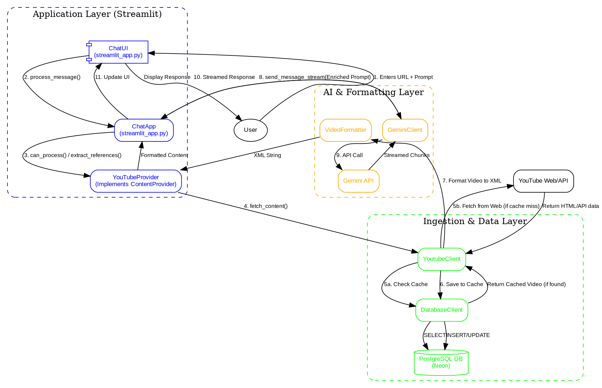

# Intelligent YouTube Content Ingestion & Interaction Pipeline

This project is a full-stack, production-ready system designed to ingest unstructured content from YouTube, process and cache it within a persistent data layer, and expose it to an interactive AI-powered chat interface.

It solves the real-world challenge of making unstructured video content queryable and useful, demonstrating a robust architecture that combines data engineering, resilient backend development, and applied AI principles.

## Live Demos
*   **[Mode 1: YouTube to XML]** - A utility to turn videos and playlists into structured, LLM-friendly XML. [Watch Demo](https://youtu.be/nW0BN7dcU1U)
*   **[Mode 2: Interactive Chat]** - The main application for holding conversations with YouTube content. [Watch Demo](https://youtu.be/qzdBK2pNnHs)

## Key Features

*   **Robust Multi-Source Ingestion:** Fetches and parses content from individual YouTube videos and entire playlists, gracefully handling metadata and transcript extraction.
*   **Persistent Caching Layer:** Utilizes a PostgreSQL database (Neon) to cache all ingested content, preventing redundant API calls, reducing latency on subsequent requests, and ensuring data durability.
*   **Interactive AI Chat Interface:** A Streamlit application provides a user-friendly interface for users to ask questions about YouTube content, with the system automatically enriching prompts for the LLM (Gemini).
*   **Production-Ready Design:** Engineered with SOLID principles, including a decoupled provider pattern, clear data models (`dataclasses`), full type-hinting for clarity and safety, and comprehensive error handling.

## System Architecture

The pipeline is designed with a clear separation of concerns, ensuring each component is specialized, testable, and maintainable. This architecture allows for easy extension to other content sources in the future.



## Technical Deep Dive: Key Design Decisions

This section highlights the engineering principles and trade-offs made to build a robust and scalable system.

#### 1. Decoupled Architecture via the Provider Pattern
The core application (`ChatApp`) is not tightly coupled to YouTube. It interacts with a generic `ContentProvider` interface (`streamlit_app.py`). This is a practical application of the **Strategy Pattern** and the **Open/Closed Principle**.
*   **Benefit:** To add a new content source (e.g., a blog post reader, a PDF analyzer), I only need to create a new class that implements the `ContentProvider` interface. The core chat logic remains untouched, making the system highly extensible and maintainable.

#### 2. Persistent Caching Strategy
Instead of fetching from YouTube on every request, the system implements a robust caching layer using a PostgreSQL database, managed by the `DatabaseClient`.
*   **Mechanism:** Before making any external network calls, `YoutubeClient` first queries the database using the video ID. If a fresh record exists, the cached data is returned instantly. If not, the data is fetched from the web, parsed, and then saved to the database for all future requests using an `INSERT ... ON CONFLICT DO UPDATE` command for efficiency.
*   **Benefit:** This design drastically reduces latency for users, minimizes load on external APIs, prevents rate-limiting, and ensures data durability.

#### 3. Resilient External API Interaction
Interacting with external web sources is often brittle. The `YoutubeClient` is engineered for resilience.
*   **Mechanism:** It uses a `requests.Session` with custom `User-Agent` headers to mimic a real browser. It employs specific, tested regular expressions to parse necessary metadata directly from the page HTML, making it less reliant on official APIs that might be rate-limited or change frequently.
*   **Benefit:** This approach is robust and adaptable, showcasing practical web scraping and data extraction skills that are vital for real-world data engineering.

#### 4. Type Safety and Clean Data Modeling
The entire codebase uses Python's type hinting, and data is encapsulated in custom `dataclasses` (`models.py`) rather than being passed around in raw dictionaries.
*   **Models:** The `Video` class provides a single, structured source of truth for all video data. The `ApiResponse` generic class standardizes all function return values, making success, data, and error states explicit and predictable.
*   **Benefit:** This enforces a high standard of code quality, dramatically improves readability, enables static analysis tools to catch bugs before runtime, and makes the system easier to debug and scale.

## Getting Started

### Prerequisites

*   Python 3.9+
*   Google Gemini API Key
*   (Optional) A Neon PostgreSQL database connection string for caching

### Installation & Setup

1.  **Clone the Repository**
    ```bash
    git clone https://github.com/BryanTheLai/Youtube-LLM.git
    cd Youtube-LLM
    ```

2.  **Create and Activate a Virtual Environment**
    ```bash
    # For Windows
    python -m venv venv
    .\venv\Scripts\activate

    # For macOS/Linux
    python3 -m venv venv
    source venv/bin/activate
    ```

3.  **Install Dependencies**
    ```bash
    pip install -r requirements.txt
    ```

4.  **Configure Environment Variables**
    Create a `.env` file in the project's root directory and add your keys:
    ```env
    # Required for AI functionality
    GEMINI_API_KEY="your_gemini_api_key"

    # Optional for caching and persistence
    NEON_YOUTUBE_DATABASE_URL="your_neon_database_url"
    ```

### Running the Application

This project contains two distinct Streamlit applications that utilize the same backend logic.

#### Main Chat Application
This is the primary interface for conversing with YouTube content.
```bash
streamlit run src/streamlit_app.py
```

#### XML Conversion Utility
This is a developer-focused tool for extracting and viewing structured video data.
```bash
streamlit run src/app.py
```